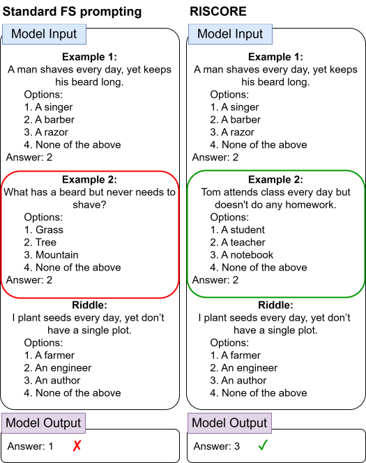
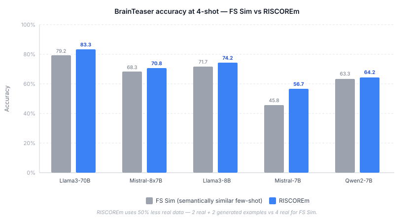
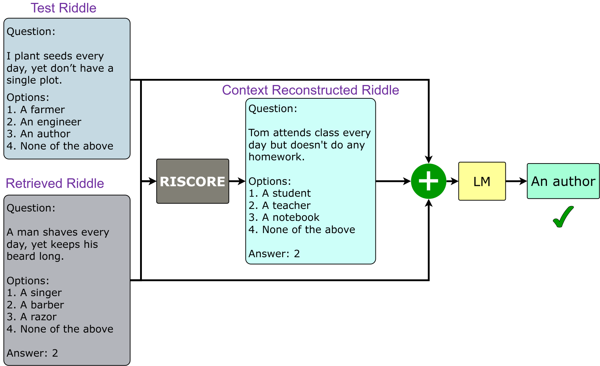
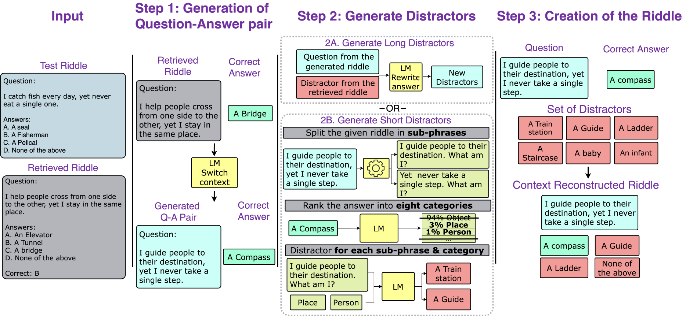

# RISCORE: Enhancing In-Context Riddle Solving in Language Models Through Context-Reconstructed Example Augmentation

*A prompting framework for riddle-solving models that need the reasoning pattern, not just similar wording.*

[](https://aclanthology.org/2025.coling-main.633/)
[](https://aclanthology.org/2025.coling-main.633.pdf)
[](setup.py)
[](LICENSE)

[Paper](https://aclanthology.org/2025.coling-main.633/) | [PDF](https://aclanthology.org/2025.coling-main.633.pdf) | [Usage](docs/USAGE.md) | [Data setup](docs/DATA.md) | [Reproducing experiments](docs/REPRODUCING.md) | [Citation](#citation)

---

<p align="center">
  
</p>

---

## The problem with semantically similar examples

Consider two riddles that look related:

- *"A man shaves every day, yet keeps his beard long."* → **A barber.**
- *"What has a beard but never needs to shave?"* → **A tree.** ("beard" here is a botanical term — the fringe on a grass spikelet.)

Standard few-shot prompting picks the second riddle as an example for the first because "beard" appears in both. But the reasoning is completely different: one exploits an occupation that mirrors what others do; the other plays on a word's secondary meaning. Feed that example and the model latches onto the shared word, not the trick.

**RISCORE** replaces that semantically similar but reasoning-different example with a *context reconstruction* — a new riddle with different words but the same underlying structure:

*"Tom attends class every day but doesn't do any homework."* → **A teacher.**

Different scenario, same pattern: someone defined by a role that mirrors what the people around them do. Strip the surface similarity, preserve the reasoning structure.

## Results

On **BrainTeaser** (Table 1, 4-shot, RISCOREm vs semantically-similar few-shot):

| Model | FS Sim | RISCOREm | Gain |
|---|---|---|---|
| Mistral-7B | 45.8% | 56.7% | **+10.9 pts** |
| Llama3-70B | 79.2% | **83.3%** | +4.1 pts |
| Llama3-8B | 71.7% | 74.2% | +2.5 pts |
| Mistral-8x7B | 68.3% | 70.8% | +2.5 pts |
| Qwen2-7B | 63.3% | 64.2% | +0.9 pts |

83.3% on Llama3-70B is the highest BrainTeaser score shown in Table 1. RISCOREm beats FS Sim at 4-shot on all five tested models.

On **RiddleSense** (vertical thinking), RISCORE gives generator-dependent evidence: some settings match or improve FS Sim, while others trail it.



## Quickstart

```bash
pip install -e .
```

```python
from riscore import RISCOREPrompt, DatasetLoader, ChatModel, Evaluator

# Full walkthrough with dataset setup and model configuration:
# docs/USAGE.md
```

## How it works

Each few-shot exemplar is paired with a context-reconstructed version of itself — same answer logic, different scenario and objects. The model attends to the abstract reasoning pattern shared across both versions rather than surface vocabulary. Reconstructions can be hand-curated (**RISCOREm**, an upper bound on quality) or auto-generated by an LLM (**RISCORE**, the practical variant that does not require ground-truth reconstructed pairs).



### Automated reconstruction pipeline



1. **Generate a question–answer pair** — switch the original riddle's context while preserving the answer logic.
2. **Generate distractors** — produce incorrect answer options appropriate to the new scenario, filtered for plausibility and distinctness.
3. **Assemble and filter** — shuffle answer positions to remove position bias, apply quality checks, and output the reconstructed multiple-choice riddle.

## Docs

- [Installation and usage](docs/USAGE.md)
- [Dataset preparation (BrainTeaser, RiddleSense)](docs/DATA.md)
- [Reproducing paper experiments](docs/REPRODUCING.md)
- [Runnable examples](examples/README.md)

<details>
<summary>Repository map</summary>

```text
riscore/
  core/         model wrappers for Hugging Face and LiteLLM providers
  data/         riddle examples, dataset loading, format conversion
  prompting/    baseline prompts, RISCORE prompts, reconstruction generation
  evaluation/   prediction records, metrics, result persistence
  utils/        config, validation, embeddings, helper utilities
examples/       runnable usage examples
scripts/        dataset preparation utilities
docs/           data and reproduction notes
assets/         figures used by this README
```

[Package overview](riscore/README.md) | [core](riscore/core/README.md) | [data](riscore/data/README.md) | [prompting](riscore/prompting/README.md) | [evaluation](riscore/evaluation/README.md) | [utils](riscore/utils/README.md)

</details>

## Citation

*Ioannis Panagiotopoulos, Giorgos Filandrianos, Maria Lymperaiou, Giorgos Stamou — AILS Lab, National Technical University of Athens. COLING 2025.*

```bibtex
@inproceedings{panagiotopoulos2025riscore,
  title={Riscore: Enhancing in-context riddle solving in language models through context-reconstructed example augmentation},
  author={Panagiotopoulos, Ioannis and Filandrianos, George and Lymperaiou, Maria and Stamou, Giorgos},
  booktitle={Proceedings of the 31st International Conference on Computational Linguistics},
  pages={9431--9455},
  year={2025}
}
```

## License

Code in this repository is released under the MIT License. Dataset use is governed by the upstream BrainTeaser and RiddleSense licenses.
